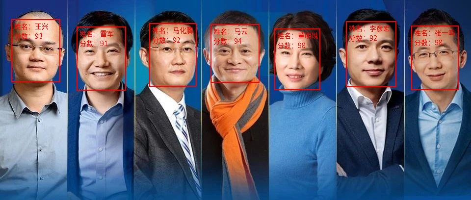
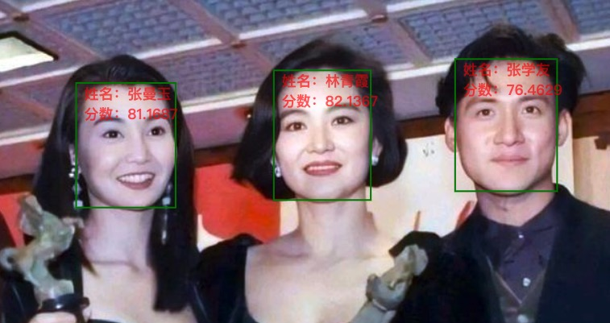

## 人脸搜索M:N

* 本项目是阿里云视觉智能开放平台的人脸1：N的开源替代，项目中使用的模型均为开源模型，项目支持opensearch(1.x版本支持milvus和proxima)向量存储库，并具有较高的自定义能力。

* 项目使用纯Java开发，免去使用Python带来的服务不稳定性。

* 1：N是通过采集某人的人像后，从海量的人像数据底库中找到与当前使用者人脸数据相符合的图像，通过数据库的比对找出"你是谁"，常见的办公楼宇的人脸考勤门禁、社区门禁、工地考勤、会签等等场景。

* M：N 是通过计算机对场景内所有人进行面部识别并与人像数据库进行比对的过程。M:N作为一种动态人脸比对，其使用率非常高，能充分应用于多种场景，例如公共安防，迎宾，机器人应用等。

* 欢迎大家贡献代码，如果你觉得项目还不错，请给个star。

### 项目简介

* 整体架构图

 

* 项目使用组件

&ensp; &ensp; 1、spring boot

&ensp; &ensp; 2、[onnx](https://github.com/onnx/onnx)

&ensp; &ensp; 3、[opensearch](https://opensearch.org/)

* 深度学习模型

&ensp; &ensp; 1、[insightface](https://github.com/deepinsight/insightface)

&ensp; &ensp; 2、[PCN](https://github.com/Rock-100/FaceKit/tree/master/PCN)

### 版本2.0.1更新

* 1、修复PCN模型存在的潜在内存泄露问题

### 版本2.0.0更新

* 1、添加对opensearch的支持，删除对proxima与milvus向量引擎的支持
* 2、更新：删除搜索结果中的距离指标，仅保留置信度指标（余弦相似度）

### 项目文档

* 在线文档：[文档-2.0.1](scripts/docs/2.0.0.md)

* swagger文档：启动项目且开启swagger，访问：host:port/doc.html, 如 http://127.0.0.1:8080/doc.html

### 搜索客户端

* Java依赖,未发布到中央仓库，需要自行编译发布到私有仓库
```
<dependency>
    <groupId>com.visual.face.search</groupId>
    <artifactId>face-search-client</artifactId>
    <version>2.0.1</version>
</dependency>
```
* 其他语言依赖

&ensp; &ensp;使用restful接口：[文档-2.0.1](scripts/docs/2.0.0.md)


### 项目部署

* docker部署，脚本目录：face-search/scripts
```
1、配置环境变量：FACESEARCH_VOLUME_DIRECTORY，指定当前的挂载根路径，默认为当前路径

2、对opensearch的挂载目录进行赋权：
 新建目录：${FACESEARCH_VOLUME_DIRECTORY:-.}/volumes-face-search/opensearch/data
 目录赋权：chmod 777 ${FACESEARCH_VOLUME_DIRECTORY:-.}/volumes-face-search/opensearch/data

3、使用opensearch作为向量搜索引擎
  docker-compose -f docker-compose-opensearch.yml --compatibility up -d

4、服务访问：
  opensearch自带的可视化工具：http://127.0.0.1:5601
  facesearch的swagger文档： http://127.0.0.1:56789/doc.html
```

* 项目编译，并打包为docker镜像
```
1、java版本最低为：11；安装maven编译工具。安装docker。
2、克隆项目
  git clone https://gitee.com/open-visual/face-search.git
3、项目打包
   cd face-search && sh scripts/docker_build.sh
```

* 部署参数

| 参数        | 描述   |  默认值  | 可选值|
| --------   | -----:  | :----:  |--------|
| VISUAL_SWAGGER_ENABLE                      | 是否开启swagger   	|   true      |                                    |
| SPRING_DATASOURCE_URL                      | 数据库地址   		    |             |                                    |
| SPRING_DATASOURCE_USERNAME                 | 数据库用户名    		|   root      |                                    |
| SPRING_DATASOURCE_PASSWORD                 | 数据库密码    		|   root      |                                    |
| VISUAL_ENGINE_OPENSEARCH_HOST              | OPENSEARCH地址   		|             |                                    |
| VISUAL_ENGINE_OPENSEARCH_PORT              | OPENSEARCH端口    	|  9200       |                                    |
| VISUAL_ENGINE_OPENSEARCH_SCHEME            | OPENSEARCH协议    	|  https      |                                    |
| VISUAL_ENGINE_OPENSEARCH_USERNAME          | OPENSEARCH用户名 		|  admin      |                                    |
| VISUAL_ENGINE_OPENSEARCH_PASSWORD          | OPENSEARCH密码   		|  admin    |                                    |
| VISUAL_MODEL_FACEDETECTION_NAME            | 人脸检测模型名称    	|  PcnNetworkFaceDetection    |PcnNetworkFaceDetection，InsightScrfdFaceDetection|
| VISUAL_MODEL_FACEDETECTION_BACKUP_NAME     | 备用人脸检测模型名称    | InsightScrfdFaceDetection  |PcnNetworkFaceDetection，InsightScrfdFaceDetection|
| VISUAL_MODEL_FACEKEYPOINT_NAME             | 人脸关键点模型名称      | InsightCoordFaceKeyPoint  |InsightCoordFaceKeyPoint|
| VISUAL_MODEL_FACEALIGNMENT_NAME            | 人脸对齐模型名称        | Simple106pFaceAlignment  |Simple106pFaceAlignment，Simple005pFaceAlignment|
| VISUAL_MODEL_FACERECOGNITION_NAME          | 人脸特征提取模型名称    | InsightArcFaceRecognition  |InsightArcFaceRecognition|

### 性能优化

* 项目中为了提高人脸的检出率，使用了主要和次要的人脸检测模型，目前实现了两种人脸检测模型insightface和PCN，在docker的服务中，默认主服务为PCN，备用服务为insightface。insightface的效率高，但针对于旋转了大角度的人脸检出率不高，而pcn则可以识别大角度旋转的图片，但效率低一些。若图像均为正脸的图像，建议使用insightface为主模型，pcn为备用模型，如何切换，请查看部署参数。

### 项目演示

* 2.0.0 测试用例(做了优化，增强了搜索结果的区分度)：face-search-test[测试用例-FaceSearchExample](https://gitee.com/open-visual/face-search/blob/master/face-search-test/src/main/java/com/visual/face/search/valid/exps/FaceSearchExample.java)

* 

### 演员识别（手机打开体验更好）
* [http://actor-search.diven.nat300.top](http://actor-search.diven.nat300.top)
* 


### 交流群

* 钉钉交流群

    关注微信公众号回复：钉钉群

* 微信交流群

    关注微信公众号回复：微信群

* 微信公众号：关注一下，是对我最大的支持


### 项目开源前端：感谢`HeX`的开源
* [https://gitee.com/hexpang/face-search-web](https://gitee.com/hexpang/face-search-web)